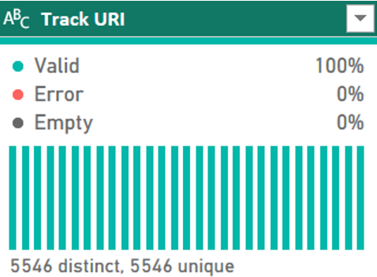
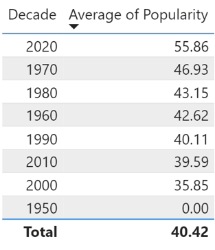
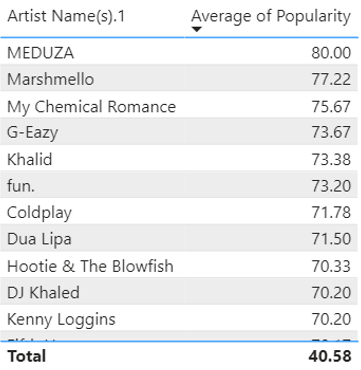
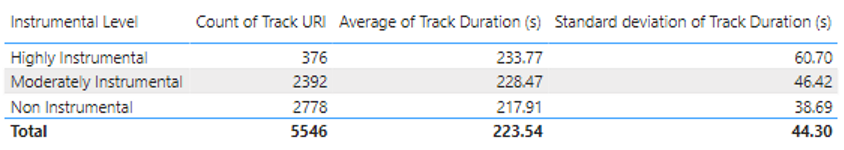

# PowerBI-Spotify-Project
This project consisted of analyzing a Spotify dataset using PowerBI to extract insights about songs and artists.

## Introduction

The objective of this report is to detail the process of cleaning and analyzing data from a dataset that gathers data from the Spotify music application. The dataset has 9,951 rows and 35 columns, including “Track Name”, “Artist”, and “Album Release Date”, among others. I used the Power BI software and the Power Query feature to carry out an analysis based on the pop genre and answered some questions relevant to this work.

## How many total songs are part of the ‘pop’ genre?

To select only songs in the “pop” genre, I opened the Power Query Editor, selected the Genres Column, and applied a Text Filter using the "Contains" feature, then in the pop-up window, I typed pop and pressed OK. After removing blank and duplicating rows by the "Track URI” column, I got 5,546 distinct and unique tracks. So there are 5,546 songs in the 'pop’ genre.

Figure 1: Total Songs in The Pop Genre

 

## For all the Pop Genre songs:

## What decade based on the year of release has the highest popularity percentage?

To analyze the year of release, I had to fix the date column where some only have a year and some have the full date. To do this, I created a Custom Column called “Full Date Release” and used the code “if Text.Length([Album Release Date]) = 4 then [Album Release Date] & "-01-01" else [Album Release Date]”, this created a column with the full date in this format year-month-day for all records. After this, I checked the data to see if there were more irregularities within dates and I found out that some dates were in this format “Jan-76", so I used the “Replace Values” feature to standardize everything. 
After getting a date for all records, I added a new column for the release decade using the Date feature on the Add Column tab. 
The 2020s has the highest average popularity, and the most popular song, with 98% of popularity is from this same decade.

Figure 2: Average Popularity by Release Decade
 

## What single artist (or group) with more than 3 songs listed where they are the primary artist has the highest popularity percentage?

To get the single artist with more than 3 songs listed, I took the artist column and split the artists using the comma delimiter when more than one is listed and I only worked with the column with the first artist listed. I built a table with the grouped artists to count how many times that artist appears in the column, and created a conditional column to highlight only those who have more than 3 records to be able to filter it later easily when I build the table on the dashboard. Working with a merged table with the grouping of artists and using a filter to work with artists that have more than 3 songs, it is possible to see that MEDUZA has the highest average popularity.

Figure 3: Average Popularity by Artist With More than 3 Records

 

## How much longer or shorter (in seconds) are songs that are more instrumental in nature? (note: you need to define in your assumptions what instrumental is)

The column “Instrumentalness” consists of values that range between 0 and 0.955, the average is 0.0159 and the median is 0.00000139. I chose to create a conditional column and categorize between “non-instrumental” “moderately instrumental” and “highly instrumental”, being highly instrumental those songs that have an instrumentalness above 0.016, and moderately instrumental those songs that have an instrumentalness above 0.0000014, and other non-instrumental. I also converted the time duration from milliseconds to seconds, dividing the values by 1,000.
The average song duration for non-instrumental songs is 217.91 seconds, for moderately instrumental is 228.47 and for highly instrumental songs is 233.77 seconds. There is not a huge difference between those values, especially considering the big standard deviation, but it is possible to see that highly instrumental tend to last a little longer than non-instrumental songs. 

Figure 4: Average Track Duration by Instrumental Level

 

